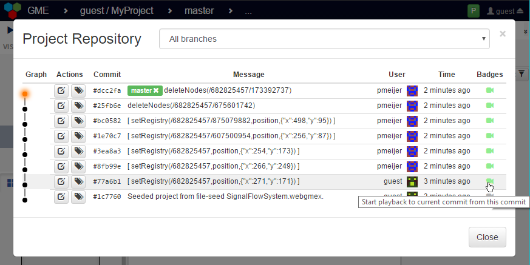
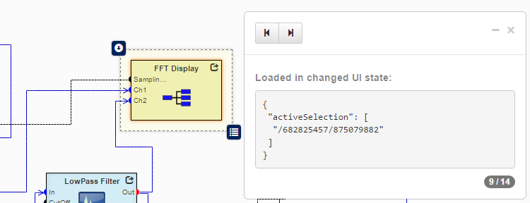
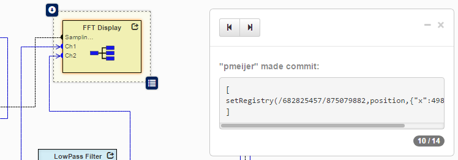
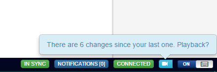

# UI-replay
This component enables users to select a range of commits and step through the changes.



The replay controller uses [the built in state object](https://github.com/webgme/webgme/wiki/GME-Visualizers#the-state-object) to load the same visual context as when the change was made.
As long as the visualizer adheres to the state changes - the replay feature will work.



Once the correct visual state is loaded - the commit is loaded and visualized.


The widget in the footer sends the extra record data to server and provides short-cuts to indicate changes.


## Using from other repository
Using the [webgme-cli](https://github.com/webgme/webgme-cli) the following pieces can easily be imported (execute from root of repository)...

#### Router
The router handles insertions of record data and exposes the record data to the ui widgets.
```
webgme import router UIRecorder webgme-ui-replay
```

To configure the database where the recording data is persisted (should not be the same as the webgme models). Add the following setting to your component settings..
```
{
 ...,
  "UIRecorderRouter": {
    "mongo": {
      "uri": "mongodb://127.0.0.1:27017/webgme-ui-recording-data",
      "options": {}
    }
  },
 ...
}
```


#### Visualizer Widgets
To import the widgets two steps are required - first make sure the widgets are available from the server.
```
webgme import viz UIReplay webgme-ui-replay
```
Secondly make them attach to the footer and project repository widget by adding (or updating) the following to your components settings.
```
{
 ...,
 "GenericUIProjectRepositoryWidget": {
   "commitBadges": {
     "UIReplayCommitBadge": {
       "path": "widgets/UIReplay/UIReplayCommitBadge"
     }
   }
 },
 "GenericUIFooterControlsPanel": {
   "extraWidgets": {
     "UIReplayWidget": {
       "path": "widgets/UIReplay/UIReplayWidget"
     }
   }
 },
 ...
}
```

## Developers

#### Publish new release at npm
 ```
 npm version 0.1.0 -m "Release %s"
 git push origin master
 git checkout v0.1.0
 git push origin v0.1.0
 npm publish ./
 ```